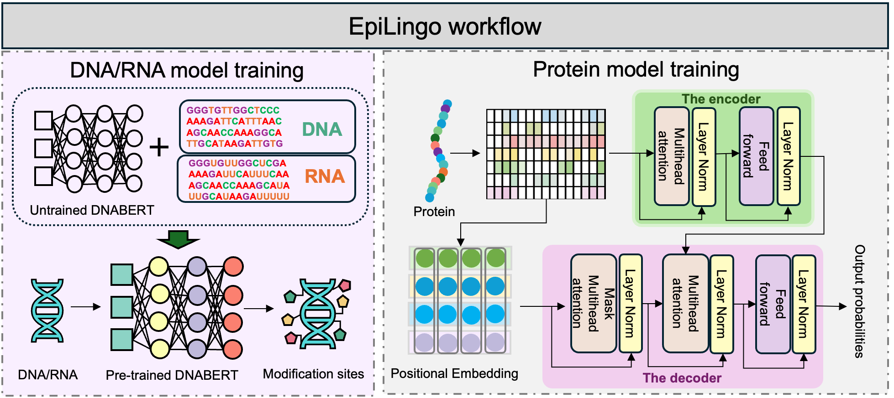

# EpiLingo: Large language model for highly multiplexed detection of multi-omics epigenetic modifications on single-base/residue resolution sequencing data
Epigenetic modifications, including DNA methylation, RNA modifications, and protein post-translational modifications (PTMs), play pivotal roles in plant development and environmental adaptation. However, current experimental and computational approaches are typically restricted to a single omics layer, modification type, or species, limiting their ability to support comprehensive regulatory analysis. Here, we introduce EpiLingo, a Transformer-based large language model framework that enables accurate prediction of 11 types of epigenetic modifications across DNA, RNA, and PTM layers in plants, using only primary sequence information without requiring structural inputs. By incorporating species-aware contextual encoding and task-specific decoders, EpiLingo achieves strong generalization performance across 31 prediction tasks spanning 15 plant species. This represents the first comprehensive prediction framework for plant epigenetic and epitranscriptomic modifications. Beyond enhancing predictive accuracy, EpiLingo reveals conserved sequence patterns and modification logic, offering a universal computational framework for decoding plant epigenetic regulation and promoting the integration of multi-omics data in precision plant science. 


### 🔍 Key Features
Cross-layer coverage: Predicts DNA methylation (4mC, 6mA), RNA modifications (m6A, m5C, Ψ), and protein post-translational modifications (e.g., lysine lactylation, crotonylation, phosphorylation, etc.)

Plant-specific: Fine-tuned across 15 plant species with species-aware tokenization and embedding

Transformer-based architecture: DNA/RNA models based on [DNABERT](https://github.com/jerryji1993/DNABERT); Protein models based on [ProteinBERT](https://github.com/nadavbra/protein_bert)

### 📁 Folder Structure
```
EpiLingo/
├── dna_rna/                # DNA & RNA modification prediction (based on DNABERT)
│   ├── run_dnarnamod.py    # Main training script
│   ├── data/               # Contains benchmark datasets
│   └── model/              # DNABERT finetuned weights
├── ptm/                    # PTM site prediction (based on ProteinBERT)
│   ├── run_ptmmod.py       # Protein model training and evaluation
│   ├── data/               # Protein sequence + label data
│   └── model/              # ProteinBERT finetuned weights
├── utils/                  # Shared preprocessing and evaluation functions
├── requirements.txt        # Required packages
└── README.md
```
### 🚀 How to Use (Detailed)
1. You can clone this repository and install dependencies (recommended in a virtual environment):
```
git clone https://github.com/DaoFuying/EpiLingo.git
cd EpiLingo
pip install -r requirements.txt --ignore-installed
```

2. DNA/RNA - Fine-tuning models and predictions:

```
cd dna_rna

#(1) Fine-tuning model based on pre-trained 6mer model

export KMER=6
export MODEL_PATH=6-new-12w-0 #Download the pre-trained model in to a directory and unzip
export DATA_PATH=data
export OUTPUT_PATH=data/model

python run_finetune.py \
    --model_type dna \
    --tokenizer_name=dna$KMER \
    --model_name_or_path $MODEL_PATH \
    --task_name dnaprom \
    --do_train \
    --do_eval \
    --data_dir $DATA_PATH \
    --max_seq_length 41 \
    --per_gpu_eval_batch_size=64   \
    --per_gpu_train_batch_size=64   \
    --learning_rate 0.0001 \
    --num_train_epochs 5.0 \
    --output_dir $OUTPUT_PATH \
    --evaluate_during_training \
    --logging_steps 100 \
    --warmup_percent 0.1 \
    --hidden_dropout_prob 0.1 \
    --overwrite_output \
    --weight_decay 0.01 \
    --n_process 8

#(2) prediction based on fine-tuning model

export KMER=6
export MODEL_PATH=data/model
export DATA_PATH=data
export PREDICTION_PATH=data/prediction

python run_finetune.py \
    --model_type dna \
    --tokenizer_name=dna$KMER \
    --model_name_or_path $MODEL_PATH \
    --task_name dnaprom \
    --do_predict \
    --data_dir $DATA_PATH  \
    --max_seq_length 41 \
    --per_gpu_pred_batch_size=128   \
    --output_dir $MODEL_PATH \
    --predict_dir $PREDICTION_PATH \
    --n_process 48
```
3. PTMs - Fine-tuning models and predictions:
In the `ptm` directory, we provide a demonstration [notebook](ptm/ptm_Arabidopsis_thaliana_phosphorylation.ipynb) that showcases the usage of EpiLingo for PTM site prediction. Users can replace the example dataset with their own data to perform customized analyses.

### 📑 Citation and Contacts
If you use our code, data, or models, please cite "EpiLingo: Large language model for highly multiplexed detection of multi-omics epigenetic modifications on single-base/residue resolution sequencing data", thank you very much. If you have any questions, please contact: fuying.dao@ntu.edu.sg.

### 🙏 Acknowledgments
This work was supported by the National Nature Scientific Foundation of China (62402089), Sichuan Science and Technology Program (2025ZNSFSC1465), and China Postdoctoral Science Foundation (2023TQ0047, GZC20230380). This research is also supported by the National Research Foundation, Singapore under its AI Singapore Programme (AISG Award No: AISG3-GV-2023-014) and by the Ministry of Education, Singapore, under its Academic Research Fund Tier 1 (RG38/23), both awarded to M.J.F. (PI).


